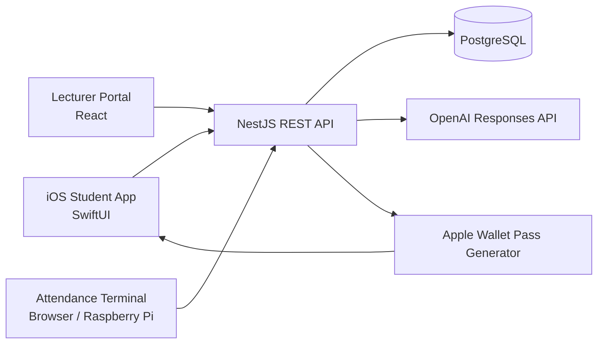
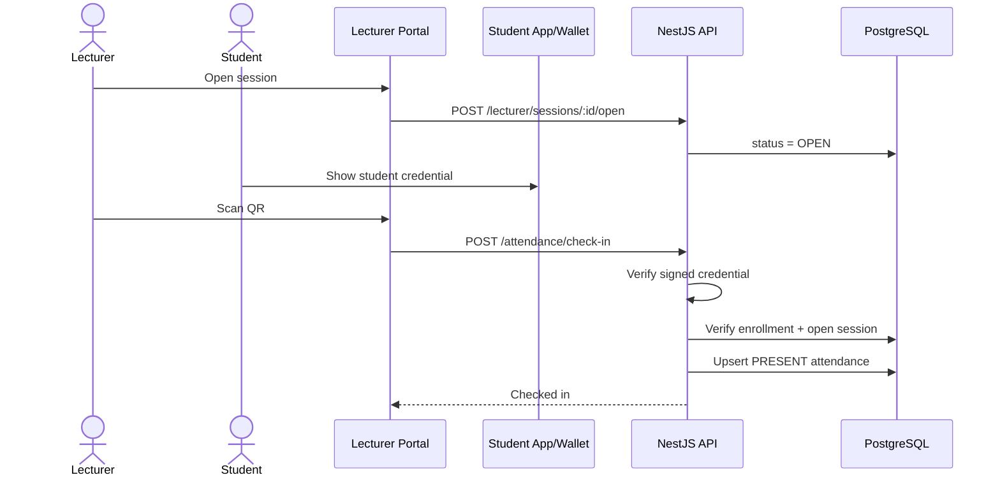
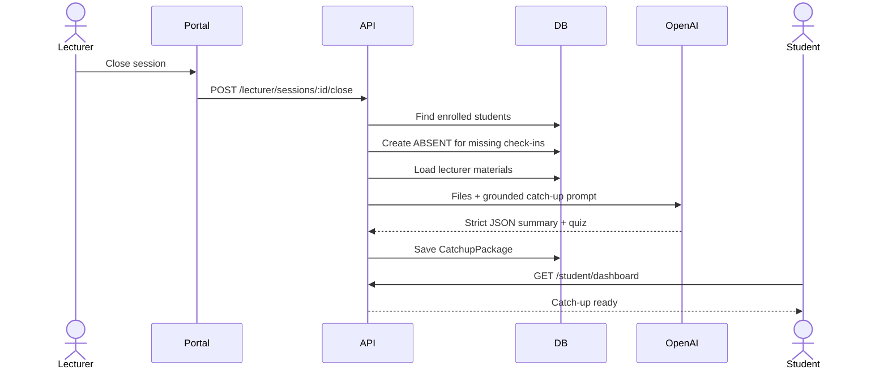
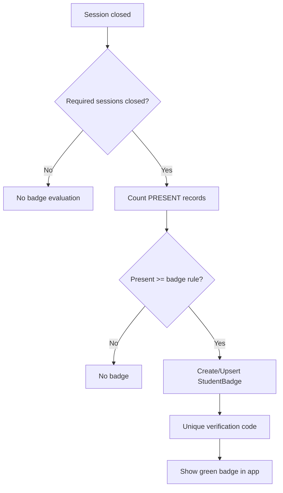
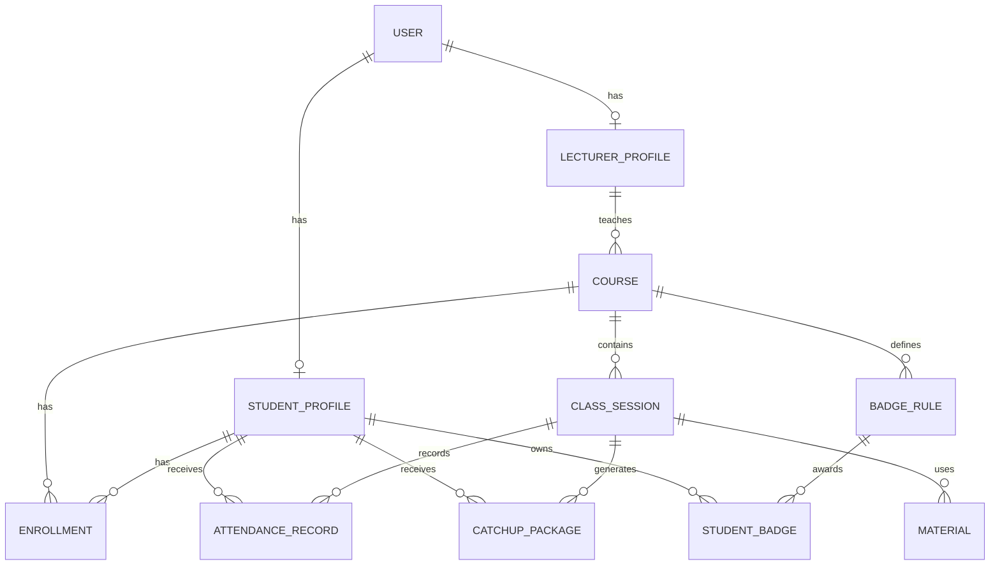
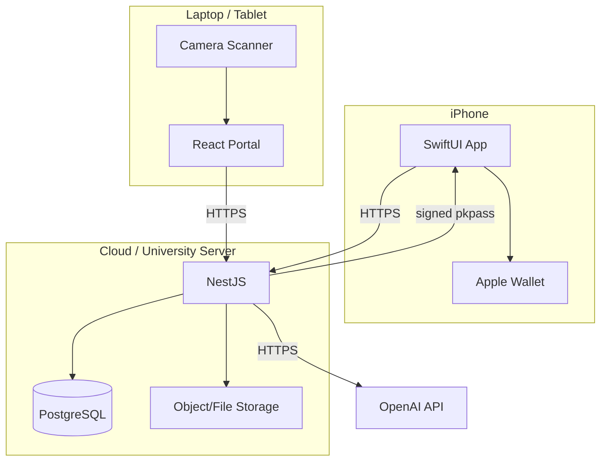

# Diagrams for the thesis

These Mermaid diagrams can be pasted into Mermaid Live Editor, GitHub, Notion, Obsidian or exported as SVG/PNG.

## Component architecture

## Attendance sequence

## Absence + Smart Catch-up sequence

## Badge sequence

## Simplified ER diagram

## Deployment diagram

